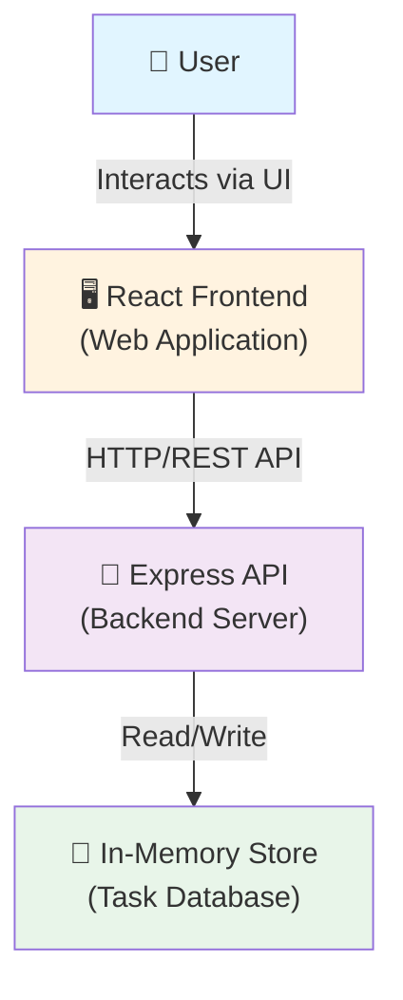
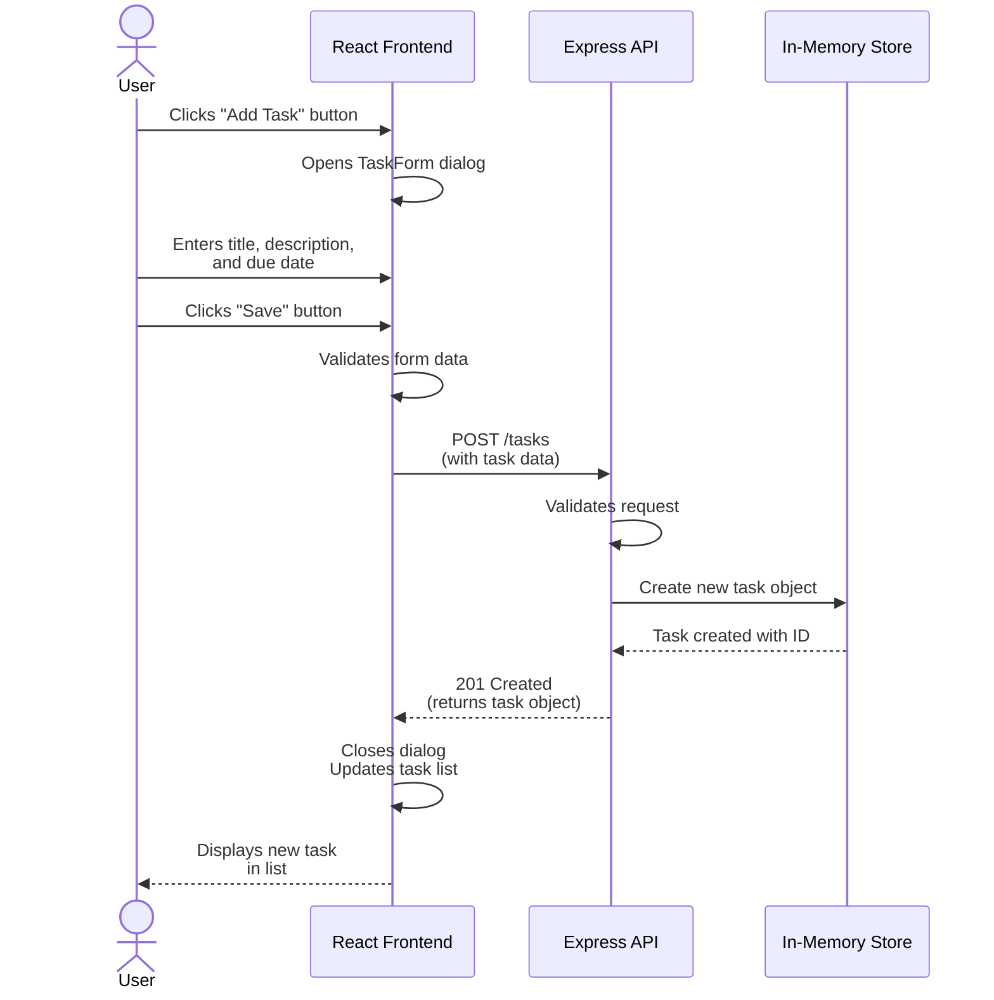

# Cloud Architecture Overview

## System Context

This TODO application consists of a React frontend, an Express API backend, and an in-memory data store. The system allows users to create, read, update, and delete tasks through a web interface.

### System Context Diagram

## Architecture Components

### Frontend (React)
- **Technology**: React, CSS
- **Responsibility**: User interface for managing tasks
- **Features**: 
  - Display list of tasks
  - Add new tasks
  - Edit existing tasks
  - Delete tasks
  - Filter and search tasks
  - Mark tasks as complete/incomplete

### Backend (Express API)
- **Technology**: Node.js, Express.js
- **Responsibility**: API endpoints for task management
- **Features**:
  - RESTful API for CRUD operations
  - Task validation
  - Data persistence coordination

### Data Store (In-Memory)
- **Technology**: JavaScript objects/arrays
- **Responsibility**: Temporary storage of task data
- **Characteristics**: 
  - Data is reset on server restart
  - No persistent storage (suitable for development/demos)

## API Endpoints

The Express backend provides the following RESTful endpoints:

- `GET /tasks` - Retrieve all tasks
- `POST /tasks` - Create a new task
- `GET /tasks/:id` - Retrieve a specific task
- `PUT /tasks/:id` - Update a task
- `DELETE /tasks/:id` - Delete a task

## Data Flow

1. User interacts with the React frontend
2. Frontend makes HTTP requests to the Express API
3. Backend processes requests and manages the in-memory store
4. Backend returns response data to frontend
5. Frontend updates the UI with the new data

## Creating a TODO - Sequence Diagram

The following sequence diagram shows the interaction flow when a user creates a new TODO task:

## Development and Deployment

This is a monorepo project using npm workspaces:
- `packages/frontend/` - React application
- `packages/backend/` - Express API server

Both can be started simultaneously using `npm run start` from the project root.
